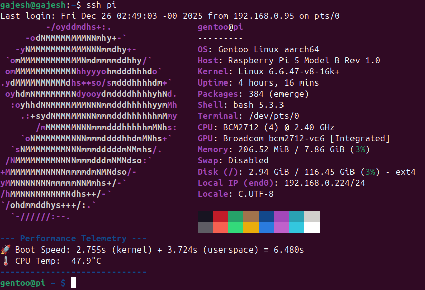

# Raspberry Pi 5 - Gentoo ARM64 (Systemd) Setup Guide

This guide documents the Gentoo installation process for the Raspberry Pi 5 (8GB) using a **chroot** environment. Below is the screenshot of the final Gentoo Installation on raspberry-pi-5 being sshed into from my Ubuntu host machine.



## 1. Disk Preparation (On Ubuntu Host)

Identify the MicroSD card (e.g., `/dev/sdb`) and prepare the partitions. You can use the commands `lsblk` to identify the correct drive letter for your MicroSD card

```bash
# Wipe existing signatures
sudo umount /dev/sdb1 /dev/sdb2
sudo wipefs -a /dev/sdb

# Partitioning with fdisk
sudo fdisk /dev/sdb
# o (New DOS table)
# n -> p -> 1 -> Enter -> +512M (Boot)
# t -> c (W95 FAT32 LBA)
# n -> p -> 2 -> Enter -> Enter (Root)
# w (Write and Exit)

# Formatting
sudo mkfs.vfat -F 32 /dev/sdb1
sudo mkfs.ext4 /dev/sdb2

# Mounting
sudo mkdir -p /mnt/gentoo
sudo mount /dev/sdb2 /mnt/gentoo
sudo mkdir -p /mnt/gentoo/boot
sudo mount /dev/sdb1 /mnt/gentoo/boot

```

## 2. Base System Extraction

Download and unpack the **ARM64 Systemd Stage 3**.

```bash
cd /mnt/gentoo
# Fetch the latest 2025 systemd build
# Gentoo Stage3 Release move often. Hence make sure you pick the latest one from https://distfiles.gentoo.org/releases/arm64/autobuilds/
sudo wget https://distfiles.gentoo.org/releases/arm64/autobuilds/current-stage3-arm64-systemd/stage3-arm64-systemd-20251214T234555Z.tar.xz

# Unpack with metadata preserved
sudo tar xpvf stage3-*.tar.xz --xattrs-include='*.*' --numeric-owner

```

## 3. Chroot & QEMU Setup

Bridge the host and guest architectures to work on the card from Ubuntu.

```bash
# Copy QEMU translator and DNS info
sudo apt install qemu-user-static
sudo cp /usr/bin/qemu-aarch64-static /mnt/gentoo/usr/bin/
sudo cp --dereference /etc/resolv.conf /mnt/gentoo/etc/

# Mount virtual filesystems
sudo mount --types proc /proc /mnt/gentoo/proc
sudo mount --rbind /sys /mnt/gentoo/sys
sudo mount --make-rslave /mnt/gentoo/sys
sudo mount --rbind /dev /mnt/gentoo/dev
sudo mount --make-rslave /mnt/gentoo/dev
sudo mount --bind /run /mnt/gentoo/run
sudo mount --make-slave /mnt/gentoo/run

# Enter the Chroot
sudo chroot /mnt/gentoo /bin/bash
source /etc/profile
export PS1="(chroot) $PS1"

```

## 4. Configuration & Optimization

### make.conf (`/etc/portage/make.conf`)

Optimized for the Pi 5's **Cortex-A76** cores:

```bash
COMMON_FLAGS="-O2 -pipe -march=armv8.2-a+crypto+fp16+rcpc+dotprod -mtune=cortex-a76"
CFLAGS="${COMMON_FLAGS}"
CXXFLAGS="${COMMON_FLAGS}"
CPU_FLAGS_ARM="edsp neon thumb vfp vfpv3 vfpv4 vfp-d32 aes sha1 sha2 crc32 v8 crypto dotprod"
MAKEOPTS="-j5"
USE="systemd -openrc unicode icu"
VIDEO_CARDS="vc4"
ACCEPT_LICENSE="*"

```

### Profile & Sync

```bash
eselect profile set 12  # default/linux/arm64/23.0/systemd (stable)
emerge-webrsync

```

## 5. Kernel & Boot Files

Install the firmware and the **16k page size** kernel image.

```bash
# Bypass QEMU sandbox issues
export FEATURES="-sandbox -usersandbox -ipc-sandbox -pid-sandbox"
emerge --ask sys-boot/raspberrypi-firmware sys-kernel/raspberrypi-image

# Verify kernel_2712.img exists in /boot
ls /boot

```

### Config Files (`/boot`)

**`config.txt`**:

```text
arm_64bit=1
enable_uart=1
device_tree=bcm2712-rpi-5-b.dtb
overlay_prefix=overlays/
dtoverlay=vc4-kms-v3d-pi5
kernel=kernel_2712.img

```

**`cmdline.txt`** (Must be a single line, comment out everything else that exists):

```text
root=/dev/mmcblk0p2 rootwait rw console=tty1 console=serial0,115200 init=/lib/systemd/systemd

```

## 6. Networking & Discovery

```bash
# Network config (/etc/systemd/network/20-eth0.network)
[Match]
Name=e*
[Network]
DHCP=yes

# Discovery and Access
emerge --ask net-dns/avahi app-admin/sudo
systemctl enable avahi-daemon
systemctl enable systemd-networkd
systemctl enable sshd
hostnamectl set-hostname pi

```

## 7. User Management

```bash
# Set Root Password
passwd root

# Add Gentoo User
useradd -m -G wheel -s /bin/bash gentoo
passwd gentoo

# Grant Sudo (uncomment %wheel)
visudo

```

## 8. Summary Checklist

* **Boot Time:** ~6.2 seconds from power to login.
* **Access:** `ssh gentoo@pi.local`.

## 9. Troubleshooting: QEMU Threading Errors
If you encounter the error `qemu: qemu_thread_create: Invalid argument during emerge` The reason for this is Portage's sandbox and multi-threading features often conflict with qemu-user-static on x86 hosts. You can disable all sandboxing with the command `export FEATURES="-sandbox -usersandbox -ipc-sandbox -pid-sandbox"` You can also force single-threaded compilation: MAKEOPTS="-j1" Perform the emerge again. Once the system is booted natively on the Pi 5, you can restore MAKEOPTS="-j5".

### 10. Optional : Enhance login message with System information
You can print the system information (CPU temp, Boot speed etc.) while logging in. Please refer to pi-status folder in the current directory to set this up.
